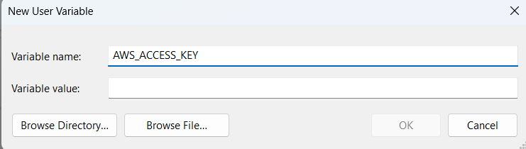
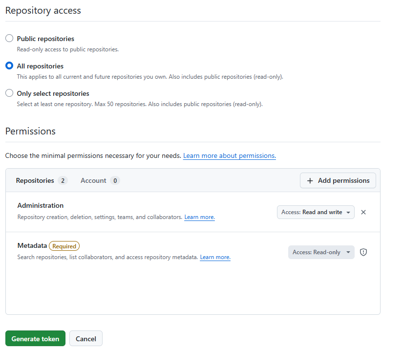

# Terraform & Infrastructure as Code 

- [Terraform \& Infrastructure as Code](#terraform--infrastructure-as-code)
  - [What is Infrastructure as Code (IaC)?](#what-is-infrastructure-as-code-iac)
  - [Two Main Types of IaC](#two-main-types-of-iac)
    - [a) **Declarative (Functional)** — Orchestration](#a-declarative-functional--orchestration)
    - [b) **Imperative (Procedural)** — Configuration Management](#b-imperative-procedural--configuration-management)
  - [Why is Terraform so popular?](#why-is-terraform-so-popular)
  - [How does Terraform work?](#how-does-terraform-work)
  - [What is `terraform.tfstate`?](#what-is-terraformtfstate)
    - [Why it’s important and sensitive:](#why-its-important-and-sensitive)
    - [Best practices:](#best-practices)
- [Terraform Setup](#terraform-setup)
  - [1. Setting up credentials (env vars)](#1-setting-up-credentials-env-vars)
  - [2. Setting up `main.tf` for making an EC2 instance](#2-setting-up-maintf-for-making-an-ec2-instance)
    - [Provider block](#provider-block)
    - [EC2 Instance Resource](#ec2-instance-resource)
    - [Variables (variables.tf)](#variables-variablestf)
  - [3. Running Terraform](#3-running-terraform)
  - [What to ignore](#what-to-ignore)
    - [GitHub `.gitignore` template for Terraform:](#github-gitignore-template-for-terraform)
- [Sparta App](#sparta-app)
  - [Front page only](#front-page-only)
  - [Front page + `/posts`](#front-page--posts)
- [Make GitHub Repo](#make-github-repo)
  - [Generate access token](#generate-access-token)


## What is Infrastructure as Code (IaC)?
**Infrastructure as Code (IaC)** is the practice of managing and provisioning infrastructure (servers, networks, storage, etc.) using **machine-readable configuration files** instead of manual setups.

**Benefits:** Consistency, repeatability, version control, automation, faster workflows, standardisation, and easier collaboration.


## Two Main Types of IaC

There are **two main IaC approaches**:

### a) **Declarative (Functional)** — Orchestration
You **define the desired end state**, and the tool figures out how to reach it.

- Example tools:
  - **Terraform**
  - **AWS CloudFormation**

- Characteristics:
  - Idempotent (running it again doesn’t recreate resources unless needed)
  - Better for provisioning infrastructure
  - Focuses on *what* you want, not how to do it  
  - **Immutable approach:** if changes are needed, it often replaces resources instead of modifying them

- Example:  
  “Create an EC2 instance using this AMI.”  
  Terraform decides the steps required.


### b) **Imperative (Procedural)** — Configuration Management
You **define the exact steps** the tool must follow.

- Example tools:
  - **Ansible**
  - **Chef**

- Characteristics:
  - Step-by-step execution
  - More control over order of actions
  - Better for installing/configuring software *inside* servers
  - **Mutable approach:** modifies existing resources instead of replacing them

- Example:  
  “SSH into the EC2 machine, install Nginx, install dependencies, restart the service.”


## Why is Terraform so popular?
- **Cloud-agnostic** (AWS, Azure, GCP, etc.)
- **Declarative & idempotent**
- **Huge module ecosystem** and community support
- **Open-source**
- Clean syntax and predictable execution via the Plan → Apply model


## How does Terraform work?
1. Write `.tf` files (infrastructure definitions)
2. `terraform fmt` → automatically format your Terraform files (optional)
3. `terraform init` → download providers & set up project
4. `terraform plan` → preview changes
5. `terraform apply` → create/update infrastructure
6. `terraform destroy` → remove managed resources

Terraform also:
- Uses **providers** to interact with cloud APIs
- Builds a **dependency graph** to work out order of operations


## What is `terraform.tfstate`?
`terraform.tfstate` is Terraform’s **state file**, used to track the resources it manages.

It stores:
- Resource IDs
- Metadata
- Relationships and dependencies

### Why it’s important and sensitive:
- Terraform uses it to know **what already exists**
- If corrupted or deleted:
  - Terraform might **recreate resources** unexpectedly
- It may contain:
  - Secrets
  - Private details
  - Cloud resource IDs

### Best practices:
- Store state **remotely** (S3, Terraform Cloud, etc.)
- Enable **state locking**
- **Never commit it to Git**
  - Commit your `.tf` files, but never commit `terraform.tfstate`, `.terraform/`, or secrets.

---

# Terraform Setup 

## 1. Setting up credentials (env vars) 

Windows:
* Settings → Edit environment variables for your account 

* Under **User variables for \<user\>**, click **New...**

* Create two user variables:
  * AWS_ACCESS_KEY
  * AWS_SECRET_ACCESS_KEY

  

    (paste keys into "Variable value")

* Restart terminal, check if set up properly with:

  * Git Bash: `printenv AWS_ACCESS_KEY`
  * Windows CMD: `echo %AWS_ACCESS_KEY%`
  * PowerShell: `echo $env:AWS_ACCESS_KEY`

  (same for AWS_SECRET_ACCESS_KEY)

Terraform automatically reads these variables whenever it needs to talk to AWS (e.g., during `terraform init`, `terraform plan`, `terraform apply`).


## 2. Setting up `main.tf` for making an EC2 instance

Link: [make-ec2/main.tf](make-ec2/main.tf)

### Provider block


```tf
provider "aws" {
  region = "eu-west-1"
}
```

* Specifies AWS as the provider
* Sets the region where resources are created
* Terraform downloads the provider during `terraform init`


### EC2 Instance Resource

```tf
resource "aws_instance" "first_app_instance" {
  ami                         = var.app_ami_id

  instance_type               = var.instance_type

  associate_public_ip_address = var.associate_public_ip

  tags = {
    Name = "tech601-martyna-tf-instance"
  }
}
```

* Creates one EC2 instance
* Pulls values from variables
* Naming:
  * `first_app_instance` → Terraform internal name
  * `tech601-martyna-tf-instance` → AWS console name


### Variables (variables.tf)

```tf
variable "app_ami_id" {
  default = "ami-02xxxxxc78ff8a"
}

variable "instance_type" {
  default = "t3.micro"
}

variable "associate_public_ip" {
  default = true
}
```

* Keep in a separate file
* Terraform loads all `.tf` files automatically
* Add this file to `.gitignore` to avoid exposing secrets


## 3. Running Terraform

Run the Terraform commands in this order inside the project folder:

```tf
terraform init
terraform fmt
terraform plan
terraform apply
```

And to delete everything, run:
```tf
terraform destroy
```

## What to ignore

* `.terraform/`
* `.terraform.lock.hcl`
* `*.tfvars`
* `variables.tf` (custom variable file)
* `*.tfstate`

### GitHub `.gitignore` template for Terraform:
https://raw.githubusercontent.com/github/gitignore/main/Terraform.gitignore


# Sparta App 

## Front page only
So far added:
- key pair 
- SG (with default VPC) - `vpc_security_group_ids` takes sg ids as strings inside square brackets
- user data to run app (`.sh` file, not a variable)

Managed to access the main page of the app through public IP. 

Next:
- add the database VM and get /posts endpoint working 
- set up a custom VPC & SG using Terraform 
- document

## Front page + `/posts`
* Add another resource to `main.tf`
* Can't use a `.sh` file for user data anymore. 
  Two options:
  * Inline inside `main.sh` adding <<-EOT at the start and EOT at the end.
    Reference the DB VM private ID as `aws_instance.db_instance.private_ip`. Order of resources in main doesn't matter.
  * Create a `.tpl` (template) file instead of `.sh` 
  
    (`.sh` will only work without any terraform variables inside it)
* Inside the app instance resource:
  
  ```tf
  # User data to run app
  # user_data = file("run_app_only.sh") - doesn't work with the database VM
  user_data = <<-EOT
  #!/bin/bash
  export DB_HOST=mongodb://${aws_instance.db_instance.private_ip}:27017/posts
  cd /home/ubuntu/tech601-sparta-app/app
  npm install
  pm2 start app.js --name app
  EOT
  ```

  Can't be added to `variable.tf` because of the DB VM private ip (would have to create a `.tpl` file)

* Add inside app resource:
  ```tf
  # Set order (DB VM first)
  depends_on = [aws_instance.db_instance]

  # Recreate app VM if user data changes (default = false)
  user_data_replace_on_change = true
  ```


Next: 
* tasks 3 & 4 (security groups with default vpc)
* custom vpc


# Make GitHub Repo 

## Generate access token 
Settings → Developer settings → Personal access tokens → Fine-grained tokens → Generate new token

Name: terraform-access




Click **Generate token**, copy it.


